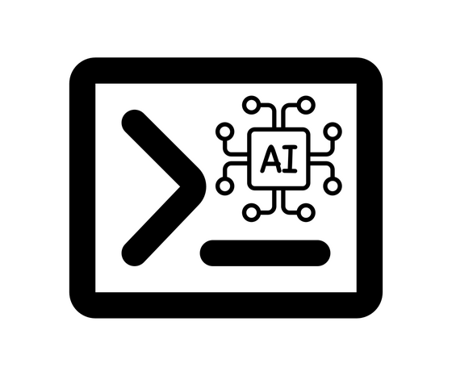

<p align="center">
  
</p>

# Use At Your Own Risk

This is current being coded using only Claude Code on my phone. It's not fully baked yet, but it's a fun experiment both to build this interesting tool as well as only try to do it from my phone. Let's see where this goes.

# aishe - AI Shell

**It's your shell, with an AI built in.** `aishe` runs real commands exactly like
zsh, and treats anything that isn't a command as a plain-English request for an
LLM — which either **suggests** a command for you to confirm or **runs
autonomously** until the task is done.

```
~/projects/app ❯ git status            # runs exactly like zsh
~/projects/app ❯ whats eating my disk  # LLM suggests: du -sh * | sort -rh | head
```

## Get productive in 60 seconds

```sh
# 1. Install (Linux/macOS; downloads the right prebuilt binary + verifies it)
curl -fsSL https://raw.githubusercontent.com/billiondollarsolo/aishe/main/install.sh | sh

# 2. Point it at a provider (any OpenAI-compatible endpoint or Anthropic)
export ANTHROPIC_API_KEY=sk-...            # or OPENAI_API_KEY / a local Ollama

# 3. Use it right away, no shell hook needed
aishe -c "turn the logs directory into a tarball"   # prints a command to run
aishe suggest --json "list files by size" | jq -r .command   # scriptable output
aishe doctor                                # verify shell, provider, and key

# 4. (Optional) make every new terminal AI-aware
echo 'eval "$(aishe init zsh)"' >> ~/.zshrc   # or: aishe init bash  >> ~/.bashrc
```

`aishe --help` lists every subcommand; `man aishe` has the full reference.

A request whose first word happens to be a real binary (`compress …`, `find …`,
`make …`) runs as that command instead of going to the model — that is the point
of a shell. Prefix it with `?` to force the natural-language route
(`aishe -c "?compress the logs into a tarball"`). See
[docs/getting-started.md](docs/getting-started.md#6-force-a-route-when-needed).

## Features

- 🐚 **Your real zsh, untouched.** aishe wraps your actual interactive zsh, so
  your plugins, completions, prompt, aliases, key bindings, and job control all
  work unmodified — it's not a shell reimplementation.
- 🗣️ **Plain English → commands.** Anything that isn't a real command is routed to
  the model. A leading `?` forces a question; a leading `!` forces a raw command.
- 🎚️ **Three modes.** `suggest` (propose, you confirm), `auto` (run safe commands,
  confirm risky ones), and `yolo` (an agentic loop that runs, reads output, and
  iterates). Cycle them live with Shift-Tab.
- 🛡️ **A safety gate you control.** A deterministic, quote/subshell/substitution-aware,
  path-aware screen flags destructive commands (`rm -rf /`, recursive `chmod`/`chown`
  on system paths, danger hidden in `$(…)` or `<(…)`, …) and asks before running them —
  and when it can't tell what a line would actually run, it asks instead of assuming.
  It's a best-effort screen for mistakes, not a security boundary; the sandbox below
  is the real isolation.
- ↩️ **Reversible.** Built-in file edits are journaled (`aishe undo`), and — on
  **Linux with bubblewrap** — you can preview a command or a whole agentic session
  against a throwaway copy (`aishe dry-run "<cmd>"`, `yolo_dry_run`) to see the exact
  diff, then apply or discard. On macOS the sandbox/overlay isn't available, so yolo
  falls back to the best-effort policy gate (`aishe doctor` shows what's active).
- 🔎 **Semantic history.** Recall past commands by meaning, not substring:
  `aishe history search "the docker run with the prometheus volume"` (or **Ctrl-X
  Ctrl-R** in the shell). Embeddings go to an OpenAI-compatible `/v1/embeddings`
  endpoint, and Ollama serves embedding models on that same route — so
  `ollama pull nomic-embed-text` plus `embedding_model = "nomic-embed-text"`
  keeps the whole feature on your machine. The index is a local file either way.
  See [docs/providers.md](docs/providers.md#embeddings-fully-offline-semantic-history).
- 🩹 **Fix-the-last-command.** When a command fails, **Ctrl-X Ctrl-F** asks the
  model for a correction (optionally re-running the failed read-only command to
  read its real error) and pre-fills it for review.
- 🔌 **Any provider, resilient.** Anthropic and any OpenAI-compatible endpoint —
  OpenAI, Groq, Ollama (local), OpenRouter, Together — with an optional fallback
  chain; `aishe doctor --probe` checks each is reachable.
- 🧰 **Agentic tools.** In yolo, the model edits files precisely, fetches web pages,
  and calls your [MCP servers](docs/mcp.md) and [skills](docs/custom-commands-and-skills.md).
- 💸 **Cost-aware.** Per-call and whole-session token/cost metering with an optional
  hard budget cap, so there are no surprise bills.
- 🔒 **Private by default.** API keys are read from the environment (never written
  to disk), secrets are redacted from the model context, and there's an optional
  local audit log (`aishe log` / `aishe usage`).
- ⚡ **Works anywhere.** `aishe -c '<line>'`, piped stdin, and a bash hook
  (`aishe init bash`) all work without launching the interactive shell.

## Install

**One line on Linux or macOS** (downloads the right prebuilt binary, verifies its
checksum, installs it, and ensures `zsh` is present):

```sh
curl -fsSL https://raw.githubusercontent.com/billiondollarsolo/aishe/main/install.sh | sh
```

<details>
<summary>Other ways to install (packages, cargo, from source)</summary>

```sh
cargo binstall aishe                       # prebuilt binary via cargo-binstall
sudo apt install ./aishe_<ver>_amd64.deb   # Debian/Ubuntu (.deb from the release)
sudo dnf install ./aishe-<ver>.x86_64.rpm  # Fedora/RHEL  (.rpm from the release)
brew install --formula ./packaging/aishe.rb
cargo install --path .                     # from a checkout (needs Rust 1.88+)
```

Every tagged release attaches per-platform tarballs (`aishe-<target>.tar.gz` +
`.sha256`) for Linux x86_64/arm64 (gnu and static musl) and macOS arm64/x86_64,
plus `.deb`/`.rpm` packages and the Homebrew formula in
[`packaging/`](packaging/aishe.rb). Full guide, completions, and uninstalling in
[docs/installation.md](docs/installation.md).
</details>

**Requirements:** `zsh` on your `PATH` for the interactive shell (the installer
adds it); `bash` is enough for `aishe -c …` and piped input. Prebuilt binaries
target macOS (arm64 / x86_64) and Linux (x86_64 / arm64) — no Rust toolchain
needed.

## Quickstart

```sh
export ANTHROPIC_API_KEY=sk-ant-...   # or OPENAI_API_KEY=...  (never written to disk)
aishe                                 # first run writes config.toml (see below)
```

Then type real commands as usual, or type a request in plain English. Not sure
your setup is right? Run `aishe doctor`. A full walkthrough is in
[docs/getting-started.md](docs/getting-started.md).

**Where aishe keeps its files.** It follows each platform's convention, so the
config directory is **not** `~/.config/aishe` on macOS:

| | Linux | macOS |
|---|---|---|
| Config, commands, skills | `~/.config/aishe/` | `~/Library/Application Support/aishe/` |
| History, logs, undo journal | `~/.local/share/aishe/` | `~/Library/Application Support/aishe/` |

A file put in the wrong directory is silently ignored, so **`aishe doctor` prints
the paths actually in use** — check it rather than guessing. `AISHE_CONFIG_DIR`
and `AISHE_DATA_DIR` override the base directory on every platform. Full table:
[docs/configuration.md](docs/configuration.md#file-locations). The rest of this
README writes these paths in their Linux form.

## Contents

- [Modes](#modes)
- [Front-ends](#front-ends)
- [Providers](#providers)
- [Commands and settings](#commands-and-settings)
- [Custom commands and skills](#custom-commands-and-skills)
- [Token usage and cost](#token-usage-and-cost)
- [Safety gate](#safety-gate)
- [Startup file (.aishrc)](#startup-file-aishrc)
- [Configuration](#configuration)
- [Documentation](#documentation)
- [Development](#development)

## Modes

| Mode      | Glyph | Behavior                                                                    |
|-----------|:-----:|-----------------------------------------------------------------------------|
| `suggest` |  `❯`  | Default. The LLM proposes a command; you confirm with `[Enter] / [e]dit / [n]`. |
| `auto`    |  `»`  | Commands the safety gate deems safe run immediately; anything it flags or cannot resolve stops and asks (see below). |
| `yolo`    |  `⚡`  | Agentic loop: the model runs commands, reads output, and iterates until done. |

The gate has **three** outcomes, not two. *Safe* (nothing matched) runs. *Could
not verify* — the gate couldn't work out what a segment would actually run —
fails closed with a yellow panel and a plain `[y/N]`. *Dangerous* prints a red
panel and requires typing the full word `yes`. Details in
[docs/safety.md](docs/safety.md#three-outcomes).

In yolo, beyond running commands the model can call built-in tools to edit files
precisely (`read_file`/`write_file`/`edit_file`/`list_dir`, `file_tools`) and read
the web (`fetch_url`, `web_tool`) instead of fighting `sed`/heredocs/`curl`; both
are on by default. Configure [MCP servers](docs/mcp.md) under `[mcp_servers]` and
their tools join the loop too (`aishe mcp` lists them).

Switch at any time with `aishe mode auto`, or start with `aishe --mode yolo`. See
[docs/modes.md](docs/modes.md) for streaming, structured output, and input
prefixes.

### Input prefixes

- `?<text>` forces natural-language, for example `?how do I find large files`
- `!<cmd>` forces shell and bypasses the safety gate, for example `!rm -rf build`

After a command fails, type `?` on the next line to ask the LLM to diagnose the
error.

## Front-ends

There are three ways to use aishe. Details in
[docs/front-ends.md](docs/front-ends.md).

1. **zsh-PTY (the interactive shell).** aishe runs your real interactive zsh
   inside a pseudo-terminal, so your full `~/.zshrc` and every plugin you already
   use (zsh-autosuggestions, zsh-syntax-highlighting, fzf-tab, powerlevel10k,
   oh-my-zsh, completions) work unmodified, including job control. A
   `command_not_found_handler` routes natural language to the LLM. **This requires
   zsh**; without it, aishe tells you to install it.

   ```sh
   aishe        # launch your zsh under aishe
   aishe zsh    # the same, explicitly
   ```

2. **Native zsh/bash hook.** Add `eval "$(aishe init zsh)"` to your `~/.zshrc`
   (or `~/.bashrc` with `init bash`) to keep your own shell session while routing
   unknown input to aishe. The bash hook is how to use aishe interactively without
   zsh. See [docs/shell-integration.md](docs/shell-integration.md).

3. **Non-interactive.** `aishe -c '<line>'` and piped stdin run lines through the
   in-process executor (zsh, falling back to bash) with no interactive terminal.

## Providers

aishe talks to two provider shapes: the **Anthropic Messages API** and any
**OpenAI-compatible Chat Completions API**. The OpenAI shape covers OpenAI,
Groq, Ollama, OpenRouter, Together, and similar services through `base_url`.

```toml
[providers.openai]
base_url = "https://api.groq.com/openai"   # or http://localhost:11434 for Ollama
api_key_env = "GROQ_API_KEY"
model = "openai/gpt-oss-120b"
```

API keys are read only from the named environment variable, never stored in the
config. See [docs/providers.md](docs/providers.md) for per-provider setup.

## Commands and settings

aishe's subcommands:

```
aishe                  launch the interactive zsh-PTY shell
aishe zsh              the same, explicitly
aishe -c '<line>'      run one line non-interactively and exit
aishe init zsh|bash    print the shell-hook snippet (for ~/.zshrc / ~/.bashrc)
aishe doctor [--probe] check shell/config/provider/API key (--probe: reachability)
aishe completions ...  print a shell completion script for aishe itself
aishe trust [PATH]     trust this repo's .aishe/config.toml, or one project file
aishe trust --list     list every trusted file
aishe untrust [PATH]   drop trust for this repo (or one file); --all for every one

aishe dry-run '<cmd>' [--apply]     preview a command's file changes, then keep/discard
aishe undo [--list]                 revert the last AI/dry-run file change set
aishe history search '<q>'|index    semantic recall over your shell history
aishe log | usage                   read the audit log / summarize token cost
aishe runbook | context             export a session as a runbook / preview context

aishe mode|model|provider [VALUE]   show or set (and persist) a setting
aishe config|mcp|commands|skills    print the active config / registries
```

`aishe mode`, `model`, and `provider` show the current value with no argument or
save a new one to your config with one (`aishe mode auto`). You can also override
per session with the `--mode`/`--model`/`--provider` flags or `$AISHE_MODE`, and
in the interactive shell **Shift-Tab** cycles the mode. Full reference in
[docs/commands.md](docs/commands.md).

A few toggles are **meta commands that live only at the aishe prompt** —
`rehash`, `sandbox`, `plan`, `cache`, `reset` (also spellable `/rehash`, …).
They are not subcommands: `aishe rehash` in a terminal fails with
`error: unrecognized subcommand`. See
[docs/commands.md](docs/commands.md#prompt-only-meta-commands).

Environment variables worth knowing: `$AISHE_MODE` sets the mode for the shell
hook, and **`AISHE_CONFIG_DIR` / `AISHE_DATA_DIR`** relocate aishe's config and
state directories on any platform (each takes a base directory; aishe appends
`aishe/`). They are the quickest way to try a throwaway setup, or to sidestep the
Linux/macOS path difference entirely:

```sh
AISHE_CONFIG_DIR=/tmp/try AISHE_DATA_DIR=/tmp/try aishe doctor
```

## Conversation memory

aishe remembers recent natural-language turns so follow-ups have context: after
"create alpha.txt containing apple", a follow-up "now do the same for beta.txt"
knows what "the same" means. Memory lives only for the session (never written to
disk), is capped in size, and is on by default. Turn it off with
`memory = false`. See [docs/modes.md](docs/modes.md).

## Custom commands and skills

Drop Markdown files into `~/.config/aishe/commands/` (user — on macOS that is
`~/Library/Application Support/aishe/commands/`; `aishe doctor` prints the real
path) or `<project>/.aishe/commands/` (project) to add your own `/commands`. The file name
is the command (`bigfiles.md` becomes `/bigfiles`). If both directories define the
same name, your user command wins — a project you cloned cannot shadow it. Project
commands that run shell are also gated the same way project config is by
`aishe trust`: aishe shows the resolved command and asks before running it.

```md
---
description: Suggest a command to find the biggest files
mode: suggest            # suggest | auto | yolo (NL commands); default = current mode
# shell: true            # run the body as a shell command instead of an NL request
---
Show the 10 largest files under $ARGUMENTS, human-readable, largest first.
```

**Skills** are the model-invoked counterpart. Put skill files in
`~/.config/aishe/skills/` (same macOS caveat) as `<name>/SKILL.md`. In yolo mode
aishe advertises each skill's `name` and `description`; when your request matches,
the model pulls the skill's full instructions into context on demand. A skill or
`shell: true` command that comes from a *project* is trust-gated: enable it with
`aishe trust <path-to-file>`.

The formats match Claude Code, so real Agent Skills from
[anthropics/skills](https://github.com/anthropics/skills) and slash commands from
collections like [wshobson/commands](https://github.com/wshobson/commands) drop
in unchanged. Ready-made examples live in [examples/commands/](examples/commands/)
and [examples/skills/](examples/skills/). Full guide:
[docs/custom-commands-and-skills.md](docs/custom-commands-and-skills.md).

## Token usage and cost

aishe meters every model call. After each interaction it prints a dim
`N in / N out / N req / ~$cost` line (disable with `show_usage = false`), and
`aishe usage` shows the session total. Costs come from a built-in price table
(USD per 1M tokens) that you can override per model in `[pricing]`. Set
`budget_usd` to stop calling the model once the estimated session cost reaches a
limit.

```toml
[aishe]
budget_usd = 0.50          # stop past ~$0.50 per session (0 = unlimited)

[pricing."openai/gpt-oss-120b"]
input = 0.15
output = 0.60
```

More in [docs/usage-and-cost.md](docs/usage-and-cost.md).

## Safety gate

Before running an LLM-proposed command (in suggest and auto, and for yolo tool
calls per the `yolo_confirm` tier), aishe screens for irreversible operations:
`rm -rf`, `dd of=/dev/...`, `mkfs`, fork bombs, `curl ... | sh`, `git push --force`
to main, `shutdown` and `reboot`, and more. Dangerous commands print a red panel
and require you to type the full word `yes`.

The screen is quote-, subshell-, and substitution-aware: *literal* danger written
inside `$(…)`, backticks, or `<(…)` is caught, so `cat <(rm -rf /etc)` is flagged.
The caveat is that this only reaches text the gate can read — a shell fed a process
substitution whose contents don't exist until run time (`bash <(curl -sL https://x.sh)`,
`source <(…)`) is **not** caught. It is also path-aware for `rm -rf`: an in-tree
relative path like `rm -rf node_modules` runs without fuss, while absolute, home,
variable, glob, or escaping targets are flagged. When the gate cannot resolve what a
command would actually run, it says so and asks instead of assuming safe (`aishe
suggest --json` reports `"risk": "unknown"`; the exit code stays `20`).

It is a pattern matcher, so `safe` means "nothing matched", not "this is safe". It
can only judge text it can resolve, which leaves whole classes it does not see
into: a wrapper or runner binary outside its built-in table, execution that happens
on another machine, a payload handed to a non-shell interpreter, and content piped
into a shell from a source it cannot read. Those classes, and why they are hard,
are in [docs/safety.md](docs/safety.md#what-the-gate-does-not-catch).

The real control for autonomous or untrusted work is isolation, not the gate: on
Linux set `sandbox_backend = "bwrap"` for OS-enforced confinement, and use `aishe
dry-run` / `yolo_dry_run` to preview changes you can apply or discard (`aishe undo`
reverts any AI edit). macOS has no sandbox backend, so yolo there falls back to the
gate alone — `aishe doctor` shows what is active. The gate does not apply to
commands you type yourself or to `!`-forced lines. Details in
[docs/safety.md](docs/safety.md).

## Logging and privacy

aishe sends an environment context block (including your recent commands) with
each request. To avoid leaking credentials, it **redacts likely secrets**
(tokens, passwords, URL credentials) from that block before sending. This is on
by default (`redact_secrets`).

An optional **audit log** records every AI call, response (with token usage), and
AI-initiated command (with exit code) as JSONL. It is off by default; enable it
with `[logging] enabled = true` or `AISHE_LOG=1`. Logged text is redacted too.
See [docs/logging.md](docs/logging.md).

## Startup file (.aishrc)

aishe sources `~/.aishrc` and an `aishrc` in its config directory (in that order)
into every delegated command, so aliases, functions, and exports you define there
are available everywhere and recognized at the prompt. `~/.aishrc` is the same on
every platform, so it is the portable place to put these.

```sh
# ~/.aishrc
alias gs='git status'
alias ll='ls -lah'
export EDITOR=nvim
gco() { git checkout "$@"; }
```

A ready-to-copy example is at [examples/aishrc](examples/aishrc).

## Configuration

The config file is `config.toml` in aishe's config directory
(`~/.config/aishe/` on Linux, `~/Library/Application Support/aishe/` on macOS;
`aishe doctor` prints the resolved path). A fully annotated example is at
[examples/config.toml](examples/config.toml), and every field is documented in
[docs/configuration.md](docs/configuration.md).

```toml
[aishe]
mode = "suggest"               # suggest | auto | yolo
provider = "anthropic"         # anthropic | openai
pty_prompt = true              # branded prompt in the zsh-PTY shell
structured = "schema"          # schema | json | prompt
stream = false                 # stream answers token-by-token
show_usage = true              # print token/cost after each model call
budget_usd = 0.0               # 0 = unlimited
memory = true                  # remember recent turns
redact_secrets = true          # scrub secrets from the model context
auto_pushd = false             # zsh AUTO_PUSHD for in-process cd
# many more fields: see examples/config.toml and docs/configuration.md

[providers.anthropic]
base_url = "https://api.anthropic.com"
api_key_env = "ANTHROPIC_API_KEY"
model = "claude-sonnet-4-20250514"

[providers.openai]
base_url = "https://api.openai.com"
api_key_env = "OPENAI_API_KEY"
model = "gpt-4o"
```

## Documentation

The [docs/](docs/) directory has the full user guide:

- [Installation](docs/installation.md)
- [Getting started](docs/getting-started.md)
- [Modes](docs/modes.md)
- [Front-ends](docs/front-ends.md)
- [Providers](docs/providers.md)
- [Configuration reference](docs/configuration.md)
- [Commands and slash-commands](docs/commands.md)
- [Custom commands and skills](docs/custom-commands-and-skills.md)
- [Token usage and cost](docs/usage-and-cost.md)
- [Safety gate](docs/safety.md)
- [Logging and privacy](docs/logging.md)
- [Shell integration and .aishrc](docs/shell-integration.md)
- [Per-project config and trust](docs/project-config.md)
- [Troubleshooting](docs/troubleshooting.md)
- [Architecture (for contributors)](docs/architecture.md)
- [Roadmap](docs/ROADMAP.md)

## Development

```sh
cargo build
cargo test            # unit and integration (integration tests spawn a real shell)
cargo clippy --all-targets -- -D warnings
cargo fmt --check

# end-to-end validation harness (no API key needed for the deterministic suites)
cargo build --release && python3 tests/admin_validation.py
```

See [docs/development.md](docs/development.md) for the test layout and how the
validation harness works, and [docs/architecture.md](docs/architecture.md) for a
contributor's map of the codebase (routing, front-ends, provider/tool/MCP layers).

## License

See [LICENSE](LICENSE).
